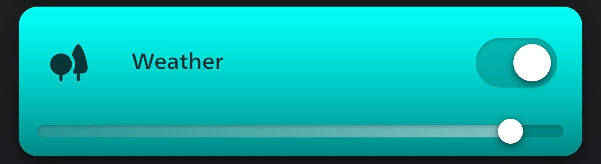
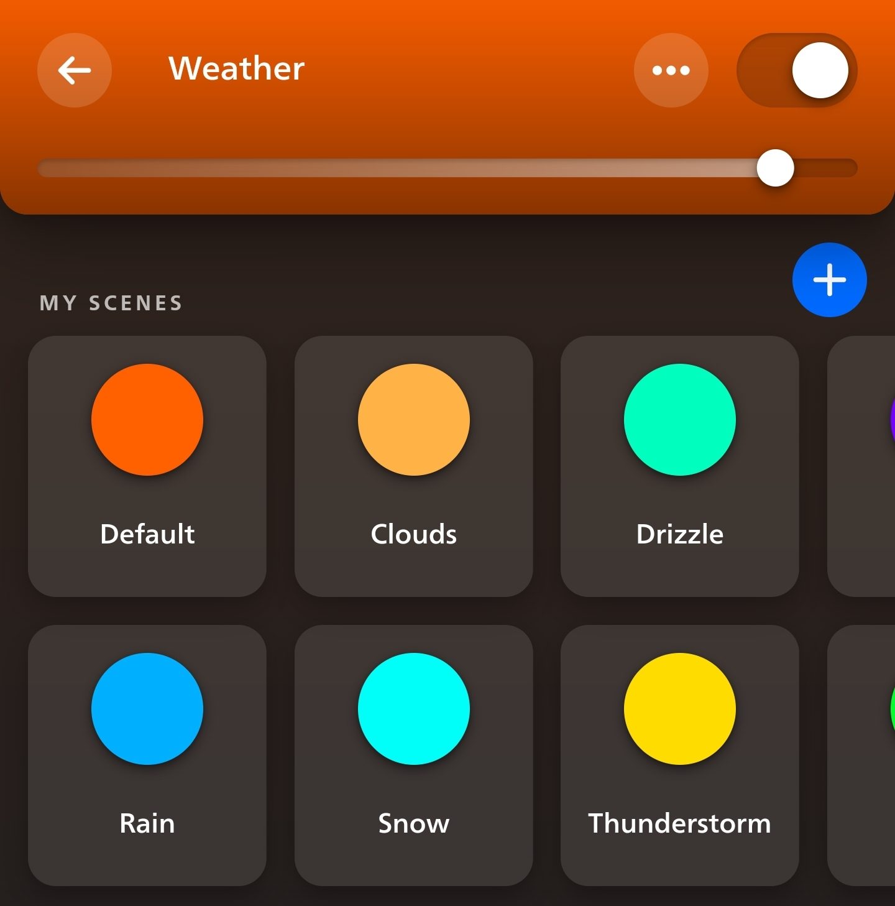
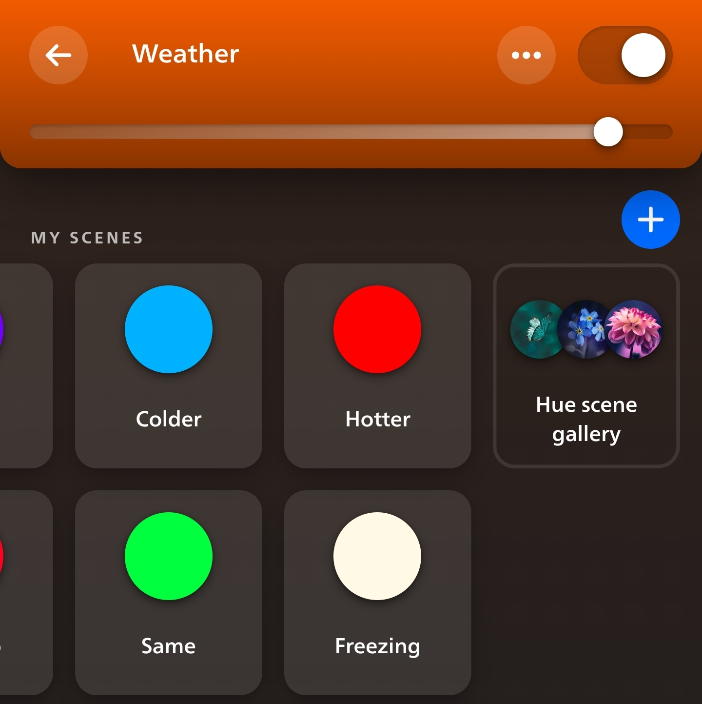
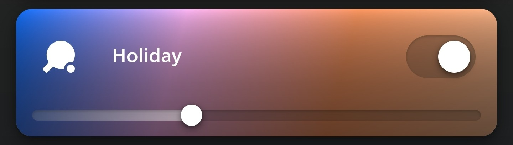
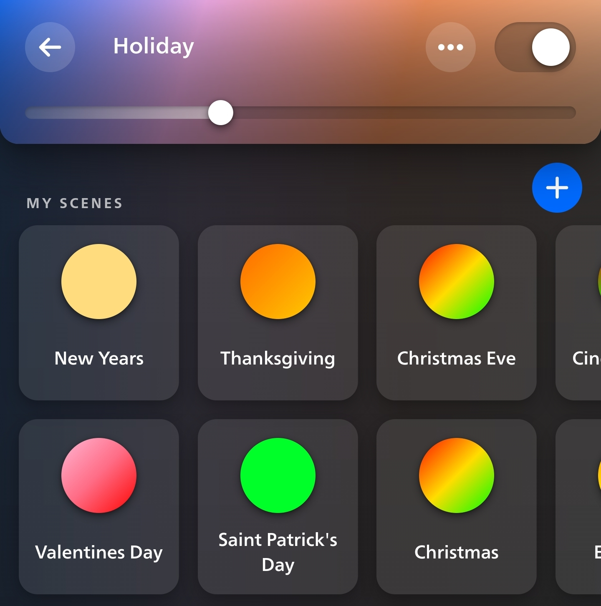
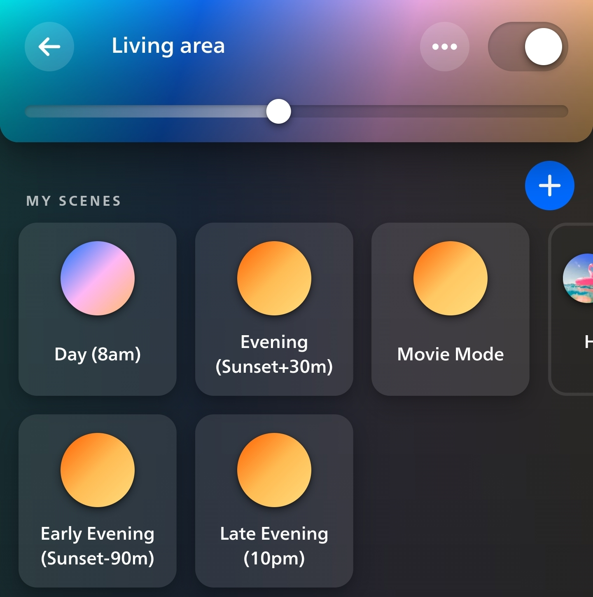

Hue Routines
===

Change your Philips Hue lights based on weather and holidays, assign scenes to times of the day and
adjust to sunset times, and more.

Can be easily run in a Docker container on a Raspberry Pi or other computer on your home network.

### Resources

- Uses the [aiohue](https://github.com/home-assistant-libs/aiohue) library to send requests to the Philips Hue bridge
- [Philips Hue Develop Get Started Guide](https://developers.meethue.com/develop/get-started-2/)
- [OpenWeather API weather conditions](https://openweathermap.org/weather-conditions) for creating weather scene names

Setup
---

### Config file
After cloning the repo, create a file named `hue_config.py` and copy the section below into it. Here you will add
info about your Philips Hue Bridge that is on your network and info about your rooms and scenes that will be used
for different features.

```python
bridge_ip = ""
hue_app_key = ""
my_timezone = "US/Eastern"
```

#### 1. Hue Bridge ip
Follow the start of the instructions in the
[Hue Getting Started Guide](https://developers.meethue.com/develop/get-started-2/) to get your Hue Bridge ip and
app key to enter in your config file. You can probably use the [Hue Discovery page](https://discovery.meethue.com/)
to find your bridge's ip. If that doesn't work there are other ways of finding it in the guide.

Enter the ip in the `bridge_ip` string of your config file.

#### 2. Hue App Key
Follow the steps in the `So let’s get started` section of the
[getting started guide](https://developers.meethue.com/develop/get-started-2/) and use the `/newdeveloper` request
to get an app key. This will be the `username` that is returned by that request
(which is `1028d66426293e821ecfd9ef1a0731df` from the example in the guide).

Enter the `username` id in the `hue_app_key` string of your config file.

#### 3. Timezone
If you are not in the US/Eastern timezone, change the `my_timezone` variable also. The code uses the
[pytz](https://pypi.org/project/pytz/) library for timezones, so use a timezone that is listed there like
`US/Central`, `US/Eastern`, `US/Mountain`, `US/Pacific`, `UTC`, `Europe/London`, etc.

#### 4. Weather API info (Optional)
To change your lights depending on the weather or to adjust times that scenes will be activated according to
sunset time you will have to get an API key from OpenWeather which is used to get weather data (it's free).

Add these fields to your `hue_config.py`:
```python
weather_api_key = ""
weather_city_name = "New York,NY,US"
```

Go to the [OpenWeather signup page](https://home.openweathermap.org/users/sign_up) and create an account. Then
use the site to create an API key and enter it under the `weather_api_key`.

Also change `weather_city_name` to the city you live in using the `City,State,Country` format like
`New York,NY,US`.

### Weather routine setup

This will change a zone's scene depending on what the current weather is, every few minutes.

_This requires the setup from `3. Weather API info` section above._

First create a zone named `Weather` using the Hue app, and add lights to it that you want to show weather scenes.



Create scenes named like the weather conditions that can be returned from the
[OpenWeather API](https://openweathermap.org/weather-conditions) (Rain, Snow, Mist etc.) You can also create a
scene name `Default` that will be triggered when there is an error when calling the weather API or there is some
weather condition that you haven't created a scene for.



#### Temperature scenes
If you have a Philips Hue Motion Sensor, you can also have the weather zone change to a temperature scene to tell
you if what the outside temperature is compared to the inside temperature every few minutes before changing to a
scene for the weather conditions (the motion sensors can also measure temperature).

The program will pick a random motion sensor that you have enabled through the Hue app to use as the "inside"
temperature, or if you want to use a specific one, create a variable named `temperature_difference_sensor_name`
in your `hue_config.py` file with the name you have given the sensor.

```python
temperature_difference_sensor_name = "Living Room Motion Sensor"
```

Create scenes named `Same`, `Hotter`, and `Colder` in your Weather zone. These will be shown depending on if the
inside temp is within 5 degrees Fahrenheit of the outside temp. You can also create a `Freezing` scene that will be
shown if the outside temp is below freezing.



### Holiday routine setup
This will change a zone's scene when it's a holiday.

On a holiday, whenever a light in this zone is turned on,
the zone will change to a scene named for that holiday if you have created it. It will only do this once an hour so if
you don't want the holiday scene on, just turn the scene off/on again to a different scene.

First create a zone named `Holiday` using the Hue app, and add lights to it that you want to show holiday scenes.



Then, create scenes with the names of holidays and set them to whatever colors you want.

Here are all the holidays that will get picked up and that you can create scenes for.
```markdown
2025-01-01 - New Year's Day
2025-01-20 - Martin Luther King Jr. Day
2025-02-14 - Valentine's Day
2025-02-15 - Susan B. Anthony Day
2025-03-17 - Saint Patrick's Day
2025-04-01 - April Fool's Day
2025-04-22 - Earth Day
2025-05-05 - Cinco de Mayo
2025-05-26 - Memorial Day
2025-06-19 - Juneteenth
2025-07-04 - Independence Day
2025-09-01 - Labor Day
2025-10-13 - Columbus Day
2025-10-31 - Halloween
2025-11-11 - Veterans Day
2025-11-27 - Thanksgiving
2025-12-24 - Christmas Eve
2025-12-25 - Christmas Day
2025-12-31 - New Year's Eve
```

Create scenes with the same names:


### Time-based scenes setup
To assign scenes to certain times of day, you can include the time they should be activated in the scene name. You can
also adjust the start time relative to the sunset time (and soon sunrise time when I get around to it).

_This requires the setup from `3. Weather API info` section above if you want to adjust start times based on sunset
time._

This time will be used in other routines like the schedules routine and if you want to turn the correct scene for the
time using a physical Hue wall switch or motion sensor.



Specify the time in parentheses () at the end of the scene name.

#### Specific time
When setting a specific scene start time, specify the time along with am/pm, you don't have to include minutes.

Examples: `(8am)`, `(10:30pm)`, `(1:23pm)`.

#### Based on sunset time
When specifying a scene start time adjusted around the time of sunset, include the word `Sunset` and any adjustment
from sunset time you want.

You can set a time before sunset by using `-` and a time after sunset by using `+`. Then
add how much time before/after sunset you want.

You can specify the adjustment by minutes or by hours, using `h` or `m` at the end.

Examples: `(Sunset)`, `(Sunset+1h)`, `(Sunset-90m)`, `(Sunset-4hours)`.

### Schedules routine setup
This will change over a room or zone's scene to a specific scene at certain times of day (only when that room's lights
are on).

_The scene start times used are based on the times that you have included in scene names, from the
`Time-based scenes setup` section above._

To enable this, simply add a list of room or zone names to your `hue_config.py` file like below:
```python
scheduled_scene_change_rooms = ["living area", "bedroom"]
```

Then at the start times you have assigned in any scene names in that room, the lights will be switched over to that
new scene if the lights were already on.

### Time-based scenes activated by Hue wall switches + dimmers
This will turn on the correct scene based on time of day when you hit a specific Philips Hue button or wall switch (
Tap Switch, Dimmer Switch, Smart Button, etc.)

If lights are already on, the configured button will turn off the lights in that room.

_The scene start times used are based on the times that you have included in scene names, from the
`Time-based scenes setup` section above._

To use a specific switch or button you have enabled in the Hue app, add it to a list in your `hue_config.py`:
```python
# format: [room name, device name, button id]
button_time_based_rooms = [["living area", "living area button dial", 1], ["bedroom", "bedroom dimmer", 1]]
```
Note: this is a list of lists. Each entry is a list with info about what room/zone should be controlled and what switch
you want to activate time-based scenes in that room.

This info should be at these positions in each list entry you add:
1. Room/zone name, e.g. `"bedroom"`
2. Name of the switch/button from the Hue app, e.g. `"bedroom dimmer"`
3. The # of the button on the switch you want to use for this room, since most Hue controls have multiple buttons on
each. For the most part, the first/top button on the switch is #1, the next is #2, etc. So on the Tap Switch Mini,
the top-left button is #1, top-right is #2, so on. e.g. `1`

### Time-based scenes activated by motion
This will turn on the correct scene based on time of day when motion is detected in a room/zone.

_The scene start times used are based on the times that you have included in scene names, from the
`Time-based scenes setup` section above._

```python
# format: [room name, seconds to turn off lights after no motion]
motion_time_based_rooms = [["bathroom", 30]]
```

Note: this is a list of lists. Each entry is a list with info about what room/zone should be controlled and how long
lights should stay on after motion is detected in that room.

This info should be at these positions in each list entry you add:
1. Room/zone name, e.g. `"bathroom"`
2. Number of seconds to keep lights on after no more motion is detected, e.g. `30`

You will also need to include the room name in the name of the motion sensor so that it is picked up to be used by this
routine. So if you are using this for `bathroom`, the motion sensor can be named something like
`Bathroom motion sensor`.

Note: if you have a Philips Hue Secure contact sensor (door sensor), you can also set this up so that the lights in a
room controlled by a motion sensor are not turned off when the door is closed. Like for a garage or bathroom, if you want
the lights to stay on if you are in it with the door closed but in an area not picked up by the motion sensor. Just add
the sensor to the door and enable it in the Hue app, then include the room name in the contact sensor name, e.g.
`Bathroom contact sensor`.

Running with Docker
---

This program can be run on a Raspberry Pi or any computer you have always running on your network.

1. Install Docker and Docker Compose on your Pi
2. Clone repo and do setup steps from above
3. From within the `hue_routines` directory, run `docker compose up -d`
4. If you want to view logs to see if there were any issues running, run the command
`docker logs $(docker container ls | grep "hue" | cut -c 1-12)` to see logs from the docker container

#### Helpful command aliases
This is my ` ~/.bash_aliases` file on my Pi that have aliases to make running some commands easier.
```
alias huerun='docker compose up -d'
alias huebuildrestart='git pull && docker compose down && docker compose up --build -d && docker rmi $(docker images -f "dangling=true" -q)'
alias huerestart='docker compose down && docker compose up -d && docker rmi $(docker images -f "dangling=true" -q)'
alias huelogs='docker logs $(docker container ls | grep "hue" | cut -c 1-12)'
alias hueconfig='nano hue_config.py'
alias deletehueconfig='rm -rf hue_config.py'
alias dockerlogs='sudo sh -c "du -ch /var/lib/docker/containers//-json.log"'
```

Example hue_config.py file
---

```python
# Always required #
bridge_ip = "123"
hue_app_key = "abc"


# Optional configurations #

# Used for any weather routines or to control lights based on sunset time
weather_api_key = "abc"
weather_city_name = "New York,NY,US"

# Used to change over scenes at certain times in some rooms
scheduled_scene_change_rooms = ["living area"]

# Used to activate time-based scenes with motion sensors
# format: [room name, seconds to turn off lights after no motion]
motion_time_based_rooms = [["bathroom", 30]]

# Used to activate time-based scenes with physical buttons/switches
# format: [room name, device name, button id]
button_time_based_rooms = [["living area", "living area button dial", 1], ["bedroom", "bedroom dimmer", 1]]

# To use a specific motion sensor to find inside temperature
temperature_difference_sensor_name = "Living Room Motion Sensor"
```